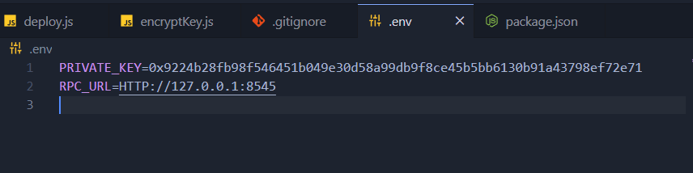

# Learn Blockchain, Solidity, and Full Stack Web3 Development with JavaScript – 32-Hour Course

Iniciar projeto:
Ubuntu Terminal

```
code web3-fcc/ethers-simple-storage-fcc
```

Iniciar ganache:

```
yarn ganache
```

Compile Contract

```
yarn run compile
```



to run after this

```
PRIVATE_KEY_PASSWORD=passwordhere node deploy.js
```

after this, to clean the enviroment history

```
history -c
```

yarn solcjs --bin --abi --include-path node_modules/ --base-path -o . SimpleStorage.sol
